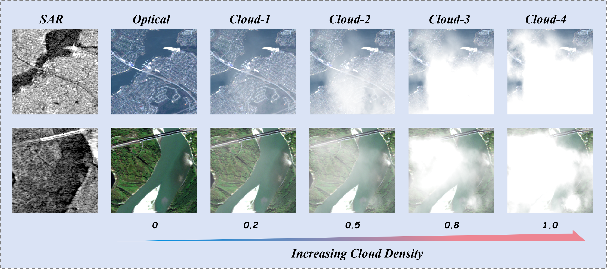
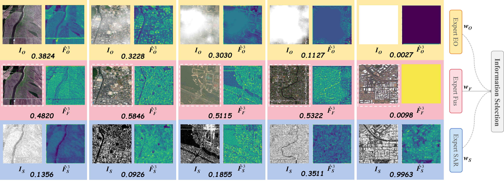

# 🔥 CAIR-Net: Reliability-Aware Information Routing for Robust Multimodal Object Detection under Modality Degradation

<p align="center">
  
</p>

<p align="center">
  <strong>IEEE TCSVT 2026</strong> | Reliability-Aware Optical–SAR Detection under Cloud Degradation
</p>

---

## 📖 Overview

Multimodal remote sensing combines **optical imagery** and **SAR** for robust object detection.  
However, in real-world scenarios:

- 🌥 Optical images are frequently degraded by **cloud occlusion**
- 📡 SAR remains stable but suffers from **noise and limited semantic detail**

❗ Under such conditions, directly fusing degraded optical features leads to **feature contamination** and severe performance degradation.

To address this, we propose **CAIR-Net**, a **reliability-aware information routing framework** that follows a:

> 🔑 **Denoise → Select → Fuse**

pipeline to suppress corrupted signals and adaptively exploit reliable information.

---

## 🚨 Limitations of Existing Methods

Existing multimodal detection approaches struggle under cloud degradation:

- ❌ **Naive fusion** assumes all modalities are equally reliable  
- ❌ **Attention-based fusion** focuses on semantics, ignoring signal quality  
- ❌ **Restoration-first methods** introduce artifacts and increase latency  
- ❌ **Lack of benchmark** for controlled cloud degradation evaluation  

👉 These methods suffer **rapid performance drop** under increasing cloud density.

---

## 📊 Dataset: MMD-C Benchmark

We construct a **controlled cloud-degraded multimodal benchmark (MMD-C)**.

### 🧩 Construction

- Built on **co-registered optical–SAR pairs**
- Only **optical modality is degraded**
- SAR remains unchanged → simulate **modality imbalance**

---

### 🌩 Cloud Degradation

Cloud corruption is generated via alpha blending
Cloud density:
0 → 0.2 → 0.5 → 0.8 → 1.0

<p align="center">
  
</p>
---

### ✨ Key Features

- ✔ Controlled and reproducible  
- ✔ Spatially heterogeneous cloud occlusion  
- ✔ Same scene under multiple degradation levels  
- ✔ Fine-grained robustness evaluation  

---

## 📦 Dataset Download

**Train Dataset**  
🔗 https://pan.quark.cn/s/caa621e0ce5b  
🔑 Code: `ApzY`

**Test Dataset**  
🔗 https://pan.quark.cn/s/e35825478a69  
🔑 Code: `UssQ`

---

## 🧠 Method: CAIR-Net

### 🔹 Core Idea

> Reformulate multimodal detection under cloud degradation as a **reliability-aware information routing problem**

Instead of directly fusing multimodal features, CAIR-Net follows a simple yet effective paradigm:

```text
Suppress unreliable regions → Select informative features → Adaptive fusion

---

## 🚀 Highlights

- 🌩 Controlled **cloud-degradation benchmark**
- 🧠 Reliability-aware routing (**LRM + GISM**)
- ⚡ End-to-end **denoise-then-fuse**
- 📉 Strong robustness under heavy clouds
- 🔄 No degradation labels required

---

## 📈 Results on MMD-C (Cloud Degradation)

We evaluate CAIR-Net under increasing cloud density levels.

| Method | L0 (mix) | L1 (0) | L2 (0.2) | L3 (0.5) | L4 (0.8) | L5 (1.0) |
|--------|----------|--------|----------|----------|----------|----------|
| MMFDet | 57.1 / 87.0 | 58.4 / 87.9 | 58.2 / 87.5 | 57.9 / 86.8 | 56.6 / 83.6 | 50.9 / 76.5 |
| DDCI   | 58.5 / 86.4 | 60.2 / 89.2 | 59.4 / 88.0 | 57.2 / 84.7 | 55.6 / 82.2 | 50.1 / 76.8 |
| C2Former | 58.9 / 87.0 | 61.2 / 89.8 | 60.7 / 88.3 | 57.9 / 86.2 | 56.1 / 83.7 | 53.1 / 79.8 |
| ICAFusion | 50.3 / 91.2 | 56.4 / 93.6 | 55.9 / 93.3 | 54.8 / 92.9 | 52.9 / 91.5 | 46.9 / 84.5 |
| CDDFuse | 53.8 / 88.7 | 56.5 / 90.6 | 55.1 / 90.0 | 54.5 / 89.6 | 53.6 / 88.7 | 52.9 / 87.9 |
| DIDFuse | 48.2 / 79.5 | 49.0 / 80.5 | 48.8 / 80.0 | 47.9 / 78.8 | 47.0 / 77.5 | 46.5 / 77.0 |
| **CAIR-Net (Ours)** | **63.8 / 94.5** | **64.1 / 94.8** | **63.5 / 94.4** | **62.7 / 93.6** | **62.3 / 93.1** | **61.9 / 92.0** |

> Metrics: AP / AP50 (%)

👉 CAIR-Net achieves **significant improvement** under cloud degradation.

---

## 🎨 Visualization

### Reliability-Aware Routing

- Optical weight ↓ as cloud increases  
- SAR weight ↑ under heavy occlusion  
- Adaptive expert selection

<p align="center">
  
</p>

👉 Model automatically **shifts reliance to reliable modality**

---
## Citation

```bibtex
@article{su2026cairnet,
  title={CAIR-Net: Reliability-Aware Information Routing for Robust Multimodal Object Detection under Modality Degradation},
  author={Su, Yudi and Ni, Jialei and Wen, Tiansheng and Liu, Hongwei and Su, Hongtao and Chen, Bo},
  journal={IEEE Transactions on Circuits and Systems for Video Technology},
  year={2026}
}

