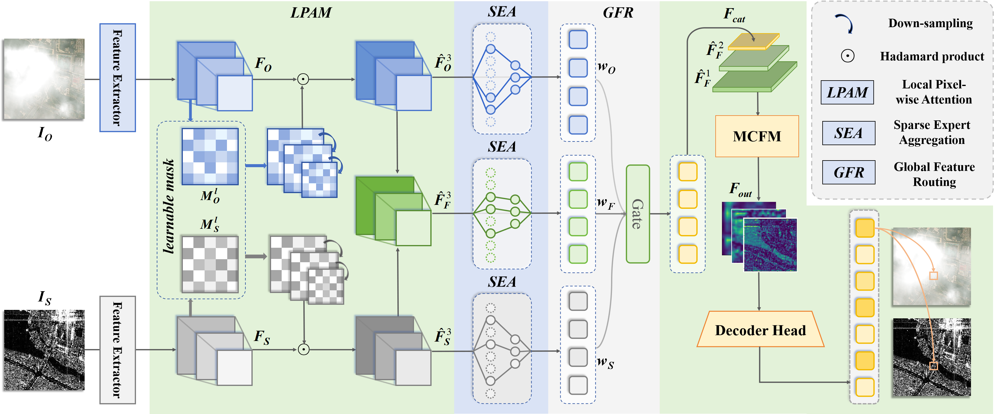

# CAIR-Net: Reliability-Aware Information Routing for Robust Multimodal Object Detection under Modality Degradation

<p align="center">
  
</p>

<p align="center">
  <strong>IEEE Transactions on Circuits and Systems for Video Technology (TCSVT), 2026</strong>
</p>

---

## Dataset Download

Train dataset:  
https://pan.quark.cn/s/caa621e0ce5b  
Code: `ApzY`

Test dataset:  
https://pan.quark.cn/s/e35825478a69  
Code: `UssQ`

---

## Paper

**CAIR-Net: Reliability-Aware Information Routing for Robust Multimodal Object Detection under Modality Degradation**

Multimodal remote sensing combines the complementary strengths of optical and SAR imagery for robust perception. However, real deployments often suffer from **modality degradation**, where optical imagery may be severely corrupted by clouds, haze, or low-light conditions, while SAR remains structurally stable but less semantically expressive. Under such modality imbalance, directly fusing degraded features can contaminate the joint representation and significantly reduce detection performance.

To address this problem, we propose **CAIR-Net**, a **reliability-aware information routing framework** for robust multimodal object detection under degraded conditions. Instead of treating all features equally, CAIR-Net follows a **denoise-then-fuse** principle: it first suppresses unreliable local regions and then adaptively routes informative features across modalities, enabling more robust fusion under partial or severe corruption.

---

## Motivation

Existing multimodal detection methods have achieved strong performance under clean and well-aligned inputs, but they still face several fundamental limitations in degraded real-world scenarios:

- **Naive fusion strategies** usually assume that all modalities are equally reliable, and therefore indiscriminately merge corrupted and clean features.
- **Attention- or gating-based one-stage fusion methods** are adaptive in a semantic sense, but they generally lack an explicit estimate of modality reliability, making them vulnerable to spatially heterogeneous corruption.
- **Restoration-first pipelines** attempt to reconstruct clean optical imagery before detection, but their restoration objective is decoupled from the downstream detection task, which may introduce artifacts, semantic drift, and additional computational overhead.
- **Most existing benchmarks** do not provide a controlled and reproducible setting for studying modality imbalance under gradually increasing degradation severity.

These limitations motivate us to formulate degraded multimodal detection as a **reliability-aware routing problem**, where the model should explicitly identify unreliable content, suppress it before cross-modal interaction, and selectively propagate trustworthy information.

---

## Dataset Construction

To support systematic evaluation, we construct **MMD-C**, a controlled multimodal degradation benchmark for optical–SAR object detection.

### Source Data

- MMD-C is built upon **co-registered optical–SAR image pairs** with object bounding-box annotations.
- To simulate realistic modality imbalance, **only the optical modality is synthetically cloud-degraded**, while the SAR modality is kept unchanged.

### Degradation Generation

Given an original optical image and a cloud mask with an alpha channel, the degraded optical image is generated by alpha blending.  
This design provides:

- **continuous and controllable cloud severity**
- **spatially heterogeneous degradation**
- **reproducible robustness evaluation under modality imbalance**

We provide five degradation levels:

- `0`
- `0.2`
- `0.5`
- `0.8`
- `1.0`

The original training split is evenly partitioned according to these degradation levels, enabling mixed-severity training and fine-grained evaluation across increasingly severe cloud conditions.

### Why MMD-C Matters

Unlike conventional clean-setting multimodal benchmarks, MMD-C explicitly isolates the impact of **optical reliability variation** while keeping other acquisition factors fixed. This makes it a practical and standardized testbed for studying robust multimodal detection under real degradation.

---

## Method

CAIR-Net is designed as a **reliability-aware fusion network** that aligns information propagation with modality quality at both the **local** and **global** levels.

### 1. Local Reliability Modulation (LRM)

The **LRM** module learns a **soft spatial reliability map** for each modality and suppresses unreliable regions before fusion.

- It acts on local feature maps in a pixel-wise manner.
- It down-weights regions severely corrupted by clouds or other local disturbances.
- It prevents degraded optical content from contaminating subsequent cross-modal interaction.

Rather than attempting to reconstruct missing content, LRM focuses on **reducing the negative impact of corrupted signals on downstream detection**.

### 2. Global Information Selection Mechanism (GISM)

To complement local suppression, CAIR-Net introduces a **Global Information Selection Mechanism (GISM)** that performs reliability-aware feature routing at the expert level.

#### Sparse Expert Activation (SEA)

- Replaces the standard Transformer FFN with a **sparse Mixture-of-Experts** design.
- Activates only the most relevant experts for each token.
- Encourages expert specialization under heterogeneous multimodal feature distributions.

#### Confidence-Aware Expert Aggregation (CEA)

- Dynamically estimates confidence weights for the **optical**, **fused**, and **SAR** branches.
- Emphasizes reliable sources while down-weighting corrupted ones.
- Enables balanced fusion instead of static averaging or hard discarding.

### 3. Denoise-Then-Fuse Principle

By combining **LRM** and **GISM**, CAIR-Net performs multimodal detection in a more principled way:

1. **Suppress unreliable local regions**
2. **Adaptively select informative experts**
3. **Aggregate optical, fused, and SAR cues according to learned confidence**

This two-level design makes CAIR-Net robust to gradual degradation, partial occlusion, and even near-complete modality failure, without requiring explicit degradation labels.

---

## Highlights

- A new **controlled cross-degradation benchmark** for multimodal object detection.
- A **reliability-aware information routing framework** tailored for degraded optical–SAR fusion.
- A **denoise-then-fuse** design that suppresses unreliable content before multimodal interaction.
- A dual-level routing mechanism combining **local reliability modulation** and **global expert selection**.
- Strong robustness under heavy cloud degradation, with much smaller performance drop than representative fusion and restoration-based baselines.

---

## Why CAIR-Net is Better

Compared with existing methods, CAIR-Net offers several clear advantages:

- **vs. one-stage fusion methods**  
  CAIR-Net does not simply attend to semantic features; it explicitly models reliability and prevents corrupted regions from entering the fusion stream.

- **vs. restoration + detection pipelines**  
  CAIR-Net remains fully end-to-end for detection, avoiding the extra overhead and task mismatch introduced by image reconstruction.

- **vs. static fusion strategies**  
  CAIR-Net adaptively routes information among optical, fused, and SAR experts according to the current degradation condition.

- **vs. degradation-label-dependent approaches**  
  CAIR-Net learns reliability-aware behavior directly from the detection objective, without requiring explicit degradation annotations.

---

## Benchmark Setting

- **Task:** multimodal remote sensing object detection
- **Modalities:** Optical + SAR
- **Controlled degradation:** cloud corruption applied only to the optical stream
- **Training setting:** mixed-severity training
- **Evaluation:** robustness under increasing cloud density

This setting better reflects realistic multimodal sensing scenarios in which one modality becomes unreliable while the other remains available.

---

## Citation

```bibtex
@article{su2026cairnet,
  title={CAIR-Net: Reliability-Aware Information Routing for Robust Multimodal Object Detection under Modality Degradation},
  author={Su, Yudi and Ni, Jialei and Wen, Tiansheng and Liu, Hongwei and Su, Hongtao and Chen, Bo},
  journal={IEEE Transactions on Circuits and Systems for Video Technology},
  year={2026}
}
